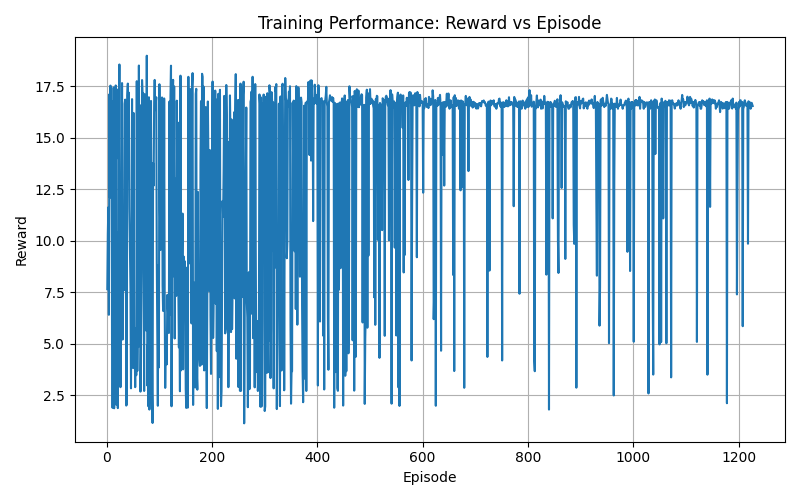

# Autonomous Driving using Reinforcement Learning 

This repository contains the final project for training an autonomous driving agent using Reinforcement Learning.
The agent learns to navigate a highway safely and efficiently.

##  Team Members & Roles
* **Nour El-Din**: Environment Setup & Reward Function Design
* **Adnan**: Model Training (PPO)
* **Fadel**: Evaluation, Video Generation & Graphs
* **Hashim**: GitHub Repository Management & Documentation

---

##  Project Goal
The main objective is to train a self-driving car to achieve a balance between:
1. **Safety:** Avoiding collisions.
2. **Speed:** Driving at an optimal speed.
3. **Lane Discipline:** Staying in the appropriate lane.

---

## The Reward Function
To teach the agent how to drive, we designed a custom reward function.

$$
R_t = \alpha \cdot v_t - \beta \cdot C_t - \gamma \cdot O_t - \delta \cdot L_t
$$

* $v_t$: Speed of the vehicle.
* $C_t$: Collision penalty.
* $O_t$: Off-road penalty.
* $L_t$: Unnecessary lane change penalty.

---

##  Results & Evaluation

### Training Performance (Reward Graph)
Here is the graph showing how the agent's reward increased over time:



### Agent Behavior (Untrained vs. Fully Trained)
> ⏳ **Coming Soon:** GIFs showing the car's driving behavior before and after training will be added here shortly by the evaluation team.

---

## How to Run Locally.
1. Clone the repository:
   ```bash
   git clone [https://github.com/Hasim1/Autonomous-Driving-RL.git](https://github.com/Hasim1/Autonomous-Driving-RL.git)